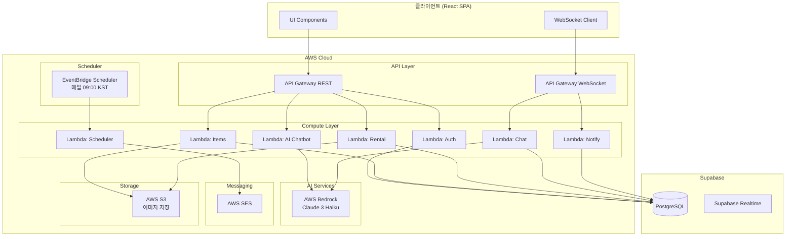
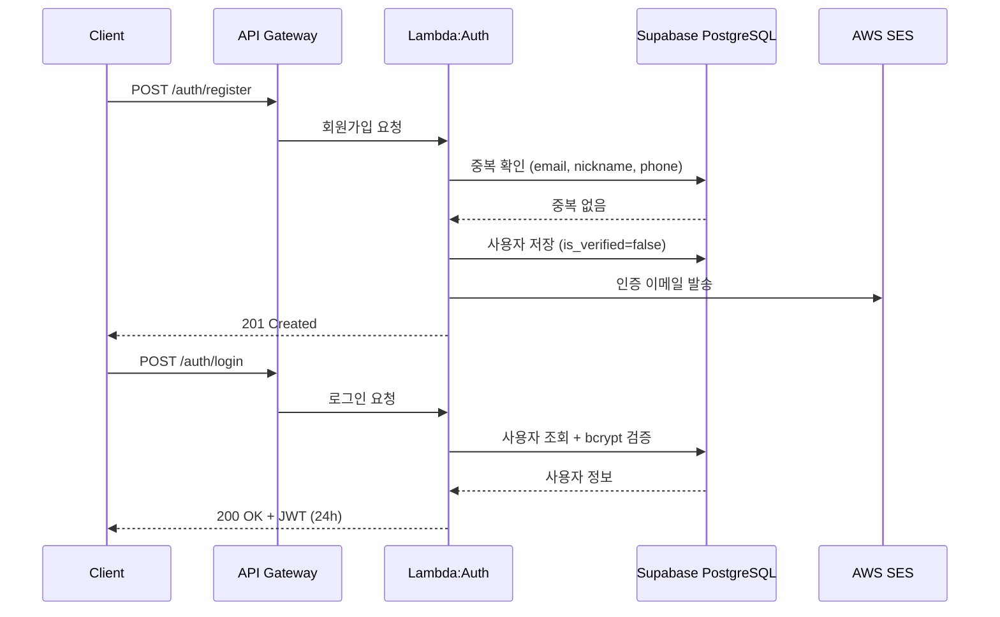
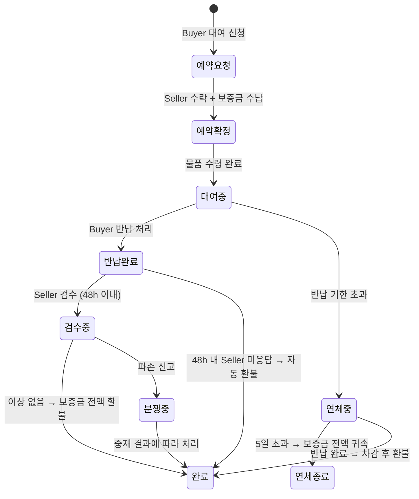
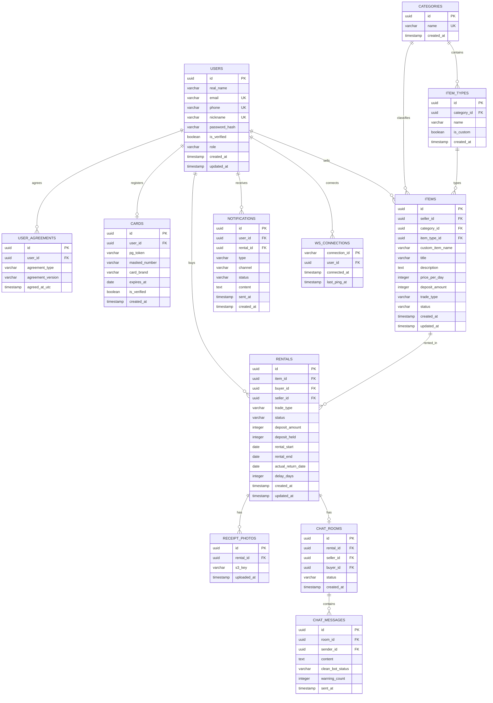

# Design Document: HARUMAN Rental Platform

## Overview

HARUMAN은 판매자(대여자)와 구매자(대여받는 자)를 연결하는 P2P/B2C 맞춤형 대여 중개 매칭 플랫폼입니다.

### 핵심 설계 목표

- **비용 효율성**: AWS Serverless 아키텍처를 통해 월 $30 이하 운영 비용 유지
- **보안성**: JWT 기반 인증, RBAC 권한 제어, 에스크로 보증금 정책으로 안전한 거래 환경 제공
- **확장성**: Lambda + API Gateway 조합으로 트래픽 급증 시 자동 스케일링
- **실시간성**: WebSocket 기반 알림 및 채팅으로 즉각적인 사용자 경험 제공
- **AI 통합**: AWS Bedrock 기반 챗봇 추천 및 Clean_Bot 콘텐츠 필터링

### 기술 스택

| 레이어 | 기술 |
|--------|------|
| Frontend | React (SPA) |
| API Gateway | AWS API Gateway (REST + WebSocket) |
| Backend | AWS Lambda (Node.js 20.x) |
| Database | Supabase PostgreSQL |
| AI | AWS Bedrock (Claude 3 Haiku) |
| Email | AWS SES |
| Storage | AWS S3 (이미지 업로드) |
| Scheduler | AWS EventBridge Scheduler |
| Auth | JWT (jsonwebtoken) + bcrypt |

---

## Architecture

### 전체 시스템 아키텍처



### 인증 흐름



### 에스크로 보증금 흐름



---

## Components and Interfaces

### REST API 엔드포인트 설계

#### 인증 (Auth)

| Method | Path | 설명 | 권한 |
|--------|------|------|------|
| POST | /auth/register | 회원가입 | Guest |
| POST | /auth/login | 로그인 + JWT 발급 | Guest |
| POST | /auth/verify-email | 이메일 인증 | Guest |
| POST | /auth/resend-verification | 인증 이메일 재발송 | Guest |
| GET | /auth/check-duplicate | 중복 확인 (email/nickname/phone) | Guest |

#### 아이템 (Items)

| Method | Path | 설명 | 권한 |
|--------|------|------|------|
| GET | /items | 아이템 목록 조회 (필터 지원) | Guest+ |
| GET | /items/:id | 아이템 상세 조회 | Guest+ |
| POST | /items | 아이템 등록 | Seller(User) |
| PUT | /items/:id | 아이템 수정 | Seller(User) |
| DELETE | /items/:id | 아이템 삭제 | Seller(User) |
| GET | /categories | 카테고리 목록 조회 | Guest+ |
| DELETE | /admin/items/:id | 아이템 강제 삭제 | Admin |

#### 대여 (Rental)

| Method | Path | 설명 | 권한 |
|--------|------|------|------|
| POST | /rentals | 대여 예약 요청 | User |
| GET | /rentals | 내 대여 내역 조회 | User |
| GET | /rentals/:id | 대여 상세 조회 | User |
| PATCH | /rentals/:id/confirm | 예약 확정 (Seller) | User |
| PATCH | /rentals/:id/return | 반납 처리 (Buyer) | User |
| PATCH | /rentals/:id/damage | 파손 신고 (Seller) | User |
| POST | /rentals/:id/receipt-photos | 수령 인증 사진 업로드 | User |

#### AI 챗봇

| Method | Path | 설명 | 권한 |
|--------|------|------|------|
| POST | /ai/chat | AI 챗봇 메시지 전송 | User |

#### 카드 관리

| Method | Path | 설명 | 권한 |
|--------|------|------|------|
| POST | /cards | 카드 등록 | User |
| GET | /cards | 등록 카드 조회 | User |
| PUT | /cards/:id | 카드 수정 | User |
| DELETE | /cards/:id | 카드 삭제 | User |

#### 마이페이지

| Method | Path | 설명 | 권한 |
|--------|------|------|------|
| GET | /users/me | 내 프로필 조회 | User |
| PUT | /users/me | 프로필 수정 | User |

### WebSocket API 설계

WebSocket 연결: `wss://{api-id}.execute-api.{region}.amazonaws.com/{stage}`

| Route Key | 방향 | 설명 |
|-----------|------|------|
| $connect | Client→Server | 연결 (JWT 검증) |
| $disconnect | Client→Server | 연결 해제 |
| sendMessage | Client→Server | 채팅 메시지 전송 |
| notification | Server→Client | 실시간 알림 전송 |
| chatMessage | Server→Client | 채팅 메시지 수신 |

### Lambda 함수 인터페이스

```typescript
// 공통 Lambda 핸들러 타입
interface LambdaEvent {
  httpMethod: string;
  path: string;
  headers: Record<string, string>;
  queryStringParameters: Record<string, string> | null;
  body: string | null;
  requestContext: {
    authorizer?: {
      userId: string;
      role: 'guest' | 'user' | 'admin';
    };
  };
}

// JWT Payload
interface JWTPayload {
  sub: string;       // userId
  role: 'user' | 'admin';
  email: string;
  iat: number;
  exp: number;       // iat + 86400 (24h)
}

// AI 챗봇 요청/응답
interface AIChatRequest {
  message: string;   // max 500 chars
}

interface AIChatResponse {
  reply: string;
  suggestedItemTypes: string[];  // 체크박스 자동 선택용
}
```

---

## Data Models

### ERD (Entity Relationship Diagram)



### 주요 테이블 상세

#### users 테이블

```sql
CREATE TABLE users (
    id UUID PRIMARY KEY DEFAULT gen_random_uuid(),
    real_name VARCHAR(50) NOT NULL,
    email VARCHAR(255) NOT NULL UNIQUE,
    phone VARCHAR(20) NOT NULL UNIQUE,
    nickname VARCHAR(30) NOT NULL UNIQUE,
    password_hash VARCHAR(255) NOT NULL,  -- bcrypt cost=10
    is_verified BOOLEAN NOT NULL DEFAULT FALSE,
    role VARCHAR(10) NOT NULL DEFAULT 'user' CHECK (role IN ('user', 'admin')),
    login_failed_count INTEGER NOT NULL DEFAULT 0,
    locked_until TIMESTAMP WITH TIME ZONE,
    created_at TIMESTAMP WITH TIME ZONE NOT NULL DEFAULT NOW(),
    updated_at TIMESTAMP WITH TIME ZONE NOT NULL DEFAULT NOW()
);
```

#### rentals 테이블

```sql
CREATE TABLE rentals (
    id UUID PRIMARY KEY DEFAULT gen_random_uuid(),
    item_id UUID NOT NULL REFERENCES items(id),
    buyer_id UUID NOT NULL REFERENCES users(id),
    seller_id UUID NOT NULL REFERENCES users(id),
    trade_type VARCHAR(20) NOT NULL CHECK (trade_type IN ('pickup_zone', 'direct_trade')),
    status VARCHAR(30) NOT NULL DEFAULT '예약요청' CHECK (
        status IN ('예약요청', '예약확정', '대여중', '반납완료', '검수중', '분쟁중', '완료', '취소', '연체중', '연체종료')
    ),
    deposit_amount INTEGER NOT NULL,
    deposit_held INTEGER NOT NULL DEFAULT 0,
    rental_start DATE NOT NULL,
    rental_end DATE NOT NULL,
    actual_return_date DATE,
    delay_days INTEGER NOT NULL DEFAULT 0,
    created_at TIMESTAMP WITH TIME ZONE NOT NULL DEFAULT NOW(),
    updated_at TIMESTAMP WITH TIME ZONE NOT NULL DEFAULT NOW()
);
```

#### chat_messages 테이블

```sql
CREATE TABLE chat_messages (
    id UUID PRIMARY KEY DEFAULT gen_random_uuid(),
    room_id UUID NOT NULL REFERENCES chat_rooms(id),
    sender_id UUID NOT NULL REFERENCES users(id),
    content TEXT NOT NULL,
    clean_bot_status VARCHAR(20) NOT NULL DEFAULT 'pending'
        CHECK (clean_bot_status IN ('pending', 'clean', 'warned', 'failed')),
    warning_count INTEGER NOT NULL DEFAULT 0,
    sent_at TIMESTAMP WITH TIME ZONE NOT NULL DEFAULT NOW()
);
```

### 보증금 계산 로직

```typescript
/**
 * 연체 보증금 계산
 * @param depositAmount 원래 보증금
 * @param delayDays 연체 일수 (1~4: 차감 환불, 5+: 전액 귀속)
 */
function calculateDepositRefund(depositAmount: number, delayDays: number): {
  refundAmount: number;
  penaltyAmount: number;
  isFullForfeiture: boolean;
} {
  if (delayDays >= 5) {
    return { refundAmount: 0, penaltyAmount: depositAmount, isFullForfeiture: true };
  }
  const penaltyRate = 0.20 * delayDays;
  const penaltyAmount = Math.floor(depositAmount * penaltyRate);
  const refundAmount = depositAmount - penaltyAmount;
  return { refundAmount, penaltyAmount, isFullForfeiture: false };
}
```

---

## Correctness Properties

*A property is a characteristic or behavior that should hold true across all valid executions of a system — essentially, a formal statement about what the system should do. Properties serve as the bridge between human-readable specifications and machine-verifiable correctness guarantees.*


### Property 1: 미인증 사용자 로그인 거부

*For any* 이메일 인증이 완료되지 않은 사용자(is_verified=false)에 대해, 해당 사용자의 올바른 자격증명으로 로그인을 시도하더라도 플랫폼은 항상 로그인을 거부해야 한다.

**Validates: Requirements 1.4**

---

### Property 2: 중복 필드 감지 일관성

*For any* 이미 데이터베이스에 존재하는 이메일, 닉네임, 또는 전화번호 값으로 중복 확인 API를 호출하면, 플랫폼은 항상 중복 오류를 반환해야 한다. 반대로 존재하지 않는 값으로 호출하면 항상 사용 가능 응답을 반환해야 한다.

**Validates: Requirements 1.5, 1.6**

---

### Property 3: 비밀번호 bcrypt 해시 저장

*For any* 임의의 비밀번호 문자열로 회원가입을 완료하면, 데이터베이스에 저장된 password_hash 값은 원본 비밀번호와 다르며 bcrypt 형식($2b$10$...)을 따라야 한다.

**Validates: Requirements 1.7**

---

### Property 4: 약관 미동의 시 등록 거부

*For any* 3개의 필수 약관(서비스 이용약관, 개인정보처리방침, 보증금 차감 정책) 중 하나라도 동의하지 않은 등록 요청에 대해, 플랫폼은 항상 등록을 거부해야 한다.

**Validates: Requirements 1.8, 1.9**

---

### Property 5: 잘못된 자격증명에 대한 제네릭 오류

*For any* 존재하지 않는 이메일 또는 잘못된 비밀번호 조합으로 로그인을 시도하면, 플랫폼은 항상 어느 필드가 틀렸는지 구분할 수 없는 동일한 제네릭 오류 메시지를 반환해야 한다.

**Validates: Requirements 2.2**

---

### Property 6: JWT 만료 시간 불변성

*For any* 유효한 사용자가 로그인하여 JWT를 발급받으면, 해당 JWT의 만료 시간(exp)은 항상 발급 시간(iat)으로부터 정확히 86400초(24시간) 후여야 한다.

**Validates: Requirements 2.3**

---

### Property 7: 만료/무효 JWT에 대한 401 응답

*For any* 보호된 API 엔드포인트에 만료되었거나 서명이 잘못된 JWT로 요청을 보내면, 플랫폼은 항상 HTTP 401 응답을 반환해야 한다.

**Validates: Requirements 2.4**

---

### Property 8: 계정 잠금 정책

*For any* 사용자가 10분 이내에 5회 연속 로그인에 실패하면, 해당 계정은 15분 동안 잠겨야 하며 잠금 기간 동안의 모든 로그인 시도는 거부되어야 한다.

**Validates: Requirements 2.6**

---

### Property 9: 역할 기반 접근 제어 (RBAC)

*For any* API 요청에 대해, JWT에 포함된 역할 클레임이 해당 엔드포인트에 요구되는 역할보다 낮거나 잘못된 형식이면, 플랫폼은 항상 HTTP 403 응답을 반환해야 한다. 특히 User 역할은 Admin 전용 엔드포인트에 접근할 수 없으며, 잘못된 역할 문자열을 포함한 JWT도 거부되어야 한다.

**Validates: Requirements 3.2, 3.4, 3.5**

---

### Property 10: 보증금 연체 계산 정확성

*For any* 보증금 금액(depositAmount > 0)과 연체 일수(delayDays >= 1)에 대해, 보증금 계산 함수는 다음 규칙을 항상 만족해야 한다:
- delayDays가 1~4인 경우: 환불액 = depositAmount × (1 - 0.20 × delayDays)
- delayDays가 5 이상인 경우: 환불액 = 0 (전액 귀속)
- 환불액 + 차감액 = 원래 보증금 (보존 법칙)

**Validates: Requirements 7.3, 7.4, 7.5**

---

### Property 11: 스케줄러 알림 대상 선택 정확성

*For any* 대여 데이터 세트에서 스케줄러가 실행될 때, 반납 기한이 현재 시각으로부터 24시간 초과 48시간 이하인 활성 대여(상태가 '취소', '완료', '반납완료'가 아닌)만 알림 대상으로 선택되어야 한다. 범위 밖의 대여는 선택되지 않아야 한다.

**Validates: Requirements 11.2**

---

### Property 12: 알림 메시지 필수 정보 포함

*For any* 반납 기한 임박 알림 생성 시, 생성된 알림 메시지는 항상 대여 ID, 물품명, 반납 기한 타임스탬프(KST)를 포함해야 한다.

**Validates: Requirements 11.3**

---

### Property 13: Clean_Bot 경고 메시지 보류

*For any* Direct_Trade 채팅 세션에서 AWS Bedrock이 경고 판정을 내린 메시지에 대해, 해당 메시지는 항상 보류 상태로 전환되고 경고 로그가 기록되어야 하며 수신자에게 즉시 전달되지 않아야 한다.

**Validates: Requirements 12.4, 13.2**

---

### Property 14: Clean_Bot 경고 누적 시 채팅 차단

*For any* 사용자가 단일 채팅 세션 내에서 3회 이상 Clean_Bot 경고를 누적하면, 해당 사용자의 채팅 접근은 항상 차단되어야 하며 이후의 모든 메시지 전송 시도는 거부되어야 한다.

**Validates: Requirements 12.5**

---

## Error Handling

### 오류 응답 형식

모든 API 오류는 일관된 JSON 형식으로 반환합니다:

```json
{
  "error": {
    "code": "ERROR_CODE",
    "message": "사용자 친화적 오류 메시지",
    "details": {}
  }
}
```

### HTTP 상태 코드 매핑

| 상황 | HTTP 코드 | 오류 코드 |
|------|-----------|-----------|
| 인증 없음 / JWT 만료 | 401 | UNAUTHORIZED |
| 권한 없음 (역할 불일치) | 403 | FORBIDDEN |
| 리소스 없음 | 404 | NOT_FOUND |
| 유효성 검사 실패 | 422 | VALIDATION_ERROR |
| 카드 미등록 | 403 | CARD_REQUIRED |
| 계정 잠금 | 423 | ACCOUNT_LOCKED |
| 서버 오류 | 500 | INTERNAL_ERROR |

### Lambda 오류 처리 전략

```typescript
// 공통 오류 핸들러
class AppError extends Error {
  constructor(
    public statusCode: number,
    public code: string,
    message: string
  ) {
    super(message);
  }
}

// Lambda 핸들러 래퍼
function withErrorHandling(handler: Function) {
  return async (event: LambdaEvent) => {
    try {
      return await handler(event);
    } catch (error) {
      if (error instanceof AppError) {
        return {
          statusCode: error.statusCode,
          body: JSON.stringify({
            error: { code: error.code, message: error.message }
          })
        };
      }
      // 예상치 못한 오류는 500으로 처리
      console.error('Unexpected error:', error);
      return {
        statusCode: 500,
        body: JSON.stringify({
          error: { code: 'INTERNAL_ERROR', message: '서버 오류가 발생했습니다.' }
        })
      };
    }
  };
}
```

### AWS Bedrock 오류 처리

- **타임아웃 (10초)**: 오류 응답 반환, 재시도 없음 (Requirement 14.3)
- **서비스 오류**: 챗봇은 "AI 추천을 불러올 수 없습니다" 메시지 표시, Clean_Bot은 메시지 통과 허용 후 실패 로그 기록
- **테스트 환경**: `NODE_ENV=test`일 때 모든 외부 서비스 호출을 mock으로 대체

### WebSocket 오류 처리

- **연결 끊김**: 30초 간격으로 최대 5회 재연결 시도
- **재연결 성공**: 누락된 알림을 시간순으로 전달
- **5회 실패**: "연결이 끊어졌습니다. 새로고침 해주세요" 메시지 표시

### 에스크로 오류 처리

- **보증금 수납 실패**: 예약 확정 취소, Buyer에게 알림
- **환불 처리 실패**: 재시도 큐에 추가, 관리자 알림
- **분쟁 중재 타임아웃**: 관리자 수동 처리 플래그 설정

---

## Testing Strategy

### 이중 테스트 접근법

이 플랫폼은 두 가지 보완적인 테스트 전략을 사용합니다:

1. **단위 테스트 (Unit Tests)**: 특정 예시, 엣지 케이스, 오류 조건 검증
2. **프로퍼티 기반 테스트 (Property-Based Tests)**: 모든 입력에 걸쳐 보편적 속성 검증

### 프로퍼티 기반 테스트 설정

**라이브러리**: `fast-check` (TypeScript/JavaScript용 PBT 라이브러리)

```bash
npm install --save-dev fast-check
```

**설정**:
- 각 프로퍼티 테스트는 최소 100회 반복 실행
- 각 테스트는 설계 문서의 프로퍼티를 참조하는 태그 포함
- 태그 형식: `Feature: haruman-rental-platform, Property {번호}: {속성 설명}`

**예시 프로퍼티 테스트**:

```typescript
import fc from 'fast-check';
import { calculateDepositRefund } from '../src/rental/deposit';

// Feature: haruman-rental-platform, Property 10: 보증금 연체 계산 정확성
describe('Property 10: 보증금 연체 계산 정확성', () => {
  it('1-4일 연체 시 올바른 환불액 계산', () => {
    fc.assert(
      fc.property(
        fc.integer({ min: 1000, max: 10000000 }),  // depositAmount
        fc.integer({ min: 1, max: 4 }),              // delayDays
        (depositAmount, delayDays) => {
          const result = calculateDepositRefund(depositAmount, delayDays);
          const expectedRefund = depositAmount * (1 - 0.20 * delayDays);
          return (
            result.refundAmount + result.penaltyAmount === depositAmount &&
            result.refundAmount === Math.floor(expectedRefund) &&
            result.isFullForfeiture === false
          );
        }
      ),
      { numRuns: 100 }
    );
  });

  it('5일 이상 연체 시 전액 귀속', () => {
    fc.assert(
      fc.property(
        fc.integer({ min: 1000, max: 10000000 }),
        fc.integer({ min: 5, max: 365 }),
        (depositAmount, delayDays) => {
          const result = calculateDepositRefund(depositAmount, delayDays);
          return result.refundAmount === 0 && result.isFullForfeiture === true;
        }
      ),
      { numRuns: 100 }
    );
  });
});
```

### 테스트 레이어 구조

```
tests/
├── unit/                    # 단위 테스트
│   ├── auth/
│   │   ├── login.test.ts
│   │   ├── register.test.ts
│   │   └── jwt.test.ts
│   ├── rental/
│   │   ├── deposit.test.ts
│   │   └── scheduler.test.ts
│   └── chat/
│       └── cleanbot.test.ts
├── property/                # 프로퍼티 기반 테스트
│   ├── auth.property.test.ts    # Properties 1-9
│   ├── deposit.property.test.ts # Property 10
│   ├── scheduler.property.test.ts # Properties 11-12
│   └── cleanbot.property.test.ts  # Properties 13-14
├── integration/             # 통합 테스트 (mock 사용)
│   ├── ses.integration.test.ts
│   ├── bedrock.integration.test.ts
│   └── websocket.integration.test.ts
└── smoke/                   # 스모크 테스트
    └── scheduler.smoke.test.ts
```

### 테스트 환경 격리

`NODE_ENV=test` 환경에서:
- AWS SES → console.log mock
- AWS Bedrock → 사전 정의된 응답 mock
- SMS API → console.log mock
- Supabase → 인메모리 테스트 DB 또는 테스트 스키마

### 성능 테스트

- **도구**: k6 또는 Artillery
- **시나리오 1**: 50 동시 사용자, 5분 지속 → 평균 응답시간 500ms 이하, 오류율 1% 미만
- **시나리오 2**: 10→200→10 사용자 스파이크 → 60초 내 오류율 1% 미만 회복
- **WebSocket**: 500 동시 연결, 1시간 → 연결 끊김률 1% 미만

### 단위 테스트 우선순위

단위 테스트는 다음에 집중합니다:
- 보증금 계산 엣지 케이스 (0원, 최대값)
- JWT 생성/검증 로직
- 역할 기반 미들웨어
- 스케줄러 시간 범위 쿼리 로직
- Clean_Bot 경고 누적 카운터
