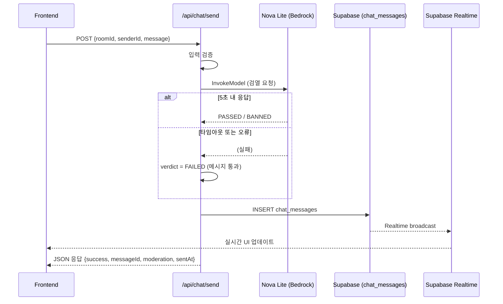

# Design Document: Nova Lite Chat Moderation

## Overview

이 기능은 `/api/chat/send` REST API 엔드포인트를 통해 채팅 메시지를 수신하고, AWS Bedrock Nova Lite 모델로 실시간 검열을 수행한 뒤 결과에 따라 Supabase `chat_messages` 테이블에 저장하는 백엔드 모듈이다.

기존 WebSocket 기반 `sendMessage` 핸들러와 별도로, 프론트엔드에서 직접 REST 호출이 가능한 경량 엔드포인트를 제공한다. 핵심 설계 원칙은 **단순성**과 **장애 허용(fail-open)** — AI 서비스 장애 시에도 채팅 기능이 중단되지 않도록 한다.

### 핵심 흐름



## Architecture

### 시스템 구성

단일 Lambda 핸들러(`moderationRouter`)가 Express 라우트로 등록되어 모든 처리를 수행한다. 기존 프로젝트 구조(`backend/src/chat/`)에 새 파일을 추가하는 방식으로 구현한다.

```
backend/src/chat/
├── cleanbot.ts          (기존 - WebSocket용 Clean_Bot)
├── sendMessage.ts       (기존 - WebSocket 핸들러)
└── moderationRouter.ts  (신규 - REST API 검열 핸들러)
```

### 설계 결정

| 결정 | 선택 | 근거 |
|------|------|------|
| 핸들러 구조 | 단일 함수 | 시간 제약 상 최소 코드, 기존 패턴 준수 |
| Nova Lite 호출 | 직접 `InvokeModelCommand` | 기존 `cleanbot.ts` 패턴 재사용 |
| 시스템 프롬프트 | 엄격한 BANNED/PASSED 전용 | 요구사항 명시, `maxTokens: 10`으로 빠른 응답 |
| 타임아웃 전략 | `Promise.race` 5초 | 기존 패턴 동일, fail-open 정책 |
| DB 클라이언트 | 기존 `getSupabaseClient()` 싱글턴 | 코드 재사용 |
| CORS | 기존 `DEFAULT_HEADERS` 패턴 | `response.ts` 헬퍼 활용 |

## Components and Interfaces

### 1. moderationRouter (핵심 핸들러)

```typescript
// POST /api/chat/send
interface ModerationRequest {
  roomId: string;    // 1–64자
  senderId: string;  // 1–64자
  message: string;   // trim 후 1–1000자
}

interface ModerationSuccessResponse {
  success: true;
  messageId: string;
  moderation: 'PASSED' | 'BANNED';
  sentAt: string;  // ISO 8601
}

interface ModerationErrorResponse {
  success: false;
  error: {
    code: string;
    message: string;
  };
}
```

### 2. moderateWithNovaLite (검열 함수)

```typescript
type ModerationVerdict = 'PASSED' | 'BANNED' | 'FAILED';

async function moderateWithNovaLite(message: string): Promise<ModerationVerdict>
```

- `BedrockRuntimeClient` (region: `ap-northeast-2`)
- `InvokeModelCommand` with `amazon.nova-lite-v1:0`
- 시스템 프롬프트: "너는 실시간 채팅방의 엄격한 보안 검열관이야." + BANNED/PASSED 규칙
- `inferenceConfig`: `{ maxTokens: 10, temperature: 0.0 }`
- 5초 `Promise.race` 타임아웃
- 파싱 실패 또는 타임아웃 → `FAILED` 반환

### 3. validateRequest (입력 검증 함수)

```typescript
interface ValidationResult {
  valid: true;
  data: { roomId: string; senderId: string; message: string };
} | {
  valid: false;
  statusCode: number;
  error: { code: string; message: string };
}

function validateRequest(body: unknown): ValidationResult
```

### 4. 기존 모듈 재사용

- `getSupabaseClient()` — DB 접근
- `successResponse()`, `errorResponse()`, `corsPreflightResponse()` — 응답 생성
- `ErrorCodes` — 오류 코드 상수

## Data Models

### chat_messages 테이블 (기존)

| 컬럼 | 타입 | 설명 |
|------|------|------|
| id | uuid (PK) | 자동 생성 |
| room_id | text | 채팅방 ID |
| sender_id | text | 발신자 ID |
| content | text | 메시지 내용 (차단 시 대체 문구) |
| clean_bot_status | text | `clean` / `banned` / `failed` |
| sent_at | timestamptz | 전송 시각 (UTC) |

### Nova Lite 요청 페이로드

```json
{
  "messages": [
    { "role": "user", "content": [{ "text": "다음 메시지를 검열해: \"{message}\"" }] }
  ],
  "system": [{ "text": "너는 실시간 채팅방의 엄격한 보안 검열관이야. ..." }],
  "inferenceConfig": { "maxTokens": 10, "temperature": 0.0 }
}
```

### Nova Lite 응답 (기대값)

```
PASSED
```
또는
```
BANNED
```

## Correctness Properties

*A property is a characteristic or behavior that should hold true across all valid executions of a system—essentially, a formal statement about what the system should do. Properties serve as the bridge between human-readable specifications and machine-verifiable correctness guarantees.*

### Property 1: Valid input acceptance

*For any* `roomId` (string, 1–64 chars), `senderId` (string, 1–64 chars), and `message` (string, 1–1000 chars after trimming with at least one non-whitespace character), the validation function SHALL return a successful result containing the extracted fields.

**Validates: Requirements 1.1**

### Property 2: Invalid input rejection

*For any* request body where `roomId` is not a string or is empty, OR `senderId` is not a string or is empty, OR `message` is not a string, is empty after trimming, or exceeds 1000 characters after trimming, OR the body is not valid JSON, the handler SHALL return an error response (HTTP 400 or 422) without proceeding to moderation.

**Validates: Requirements 1.2, 1.3, 1.4, 1.5, 1.6**

### Property 3: Verdict parsing correctness

*For any* Nova Lite response string, if the trimmed text equals "PASSED" or "BANNED" (case-sensitive), the parser SHALL return the corresponding verdict; for any other string content (including empty, whitespace-only, or unrecognized text), the parser SHALL return `FAILED`.

**Validates: Requirements 2.5, 4.2**

### Property 4: Message storage content determined by verdict

*For any* valid message and moderation verdict: if verdict is `PASSED` or `FAILED`, the stored `content` SHALL equal the original message; if verdict is `BANNED`, the stored `content` SHALL equal "클린봇에 의해 차단된 메시지입니다." — and the `clean_bot_status` field SHALL be `clean`, `failed`, or `banned` respectively.

**Validates: Requirements 3.1, 3.2, 3.5**

### Property 5: Internal error non-exposure

*For any* database error with arbitrary error message content, the API response body SHALL NOT contain the original database error message, and SHALL only contain a generic user-facing error message.

**Validates: Requirements 3.4**

### Property 6: CORS headers present on all responses

*For any* request to the endpoint (valid, invalid, error, or OPTIONS preflight), the response SHALL include `Access-Control-Allow-Origin: *`, `Access-Control-Allow-Headers: Content-Type,Authorization`, and `Access-Control-Allow-Methods: POST,OPTIONS` headers.

**Validates: Requirements 5.3, 5.5**

## Error Handling

### 오류 처리 전략

| 오류 유형 | HTTP 코드 | 처리 방식 |
|-----------|-----------|-----------|
| 잘못된 JSON 바디 | 400 | 즉시 반환, 검열 미수행 |
| 필수 필드 누락/유효하지 않음 | 422 | 즉시 반환, 검열 미수행 |
| Nova Lite 타임아웃 (5초) | — | verdict=FAILED, 메시지 통과 |
| Nova Lite 네트워크 오류 | — | verdict=FAILED, 메시지 통과 |
| Nova Lite 응답 파싱 실패 | — | verdict=FAILED, 메시지 통과 |
| Supabase INSERT 실패 | 500 | 에러 응답, 내부 상세 미노출 |
| 예상치 못한 서버 오류 | 500 | 에러 응답, 내부 상세 미노출 |

### Fail-Open 정책

AI 검열 서비스의 어떤 장애도 채팅 기능을 중단시키지 않는다:
- 타임아웃, 네트워크 오류, 파싱 실패 → 모두 `clean_bot_status: "failed"`로 저장
- 원본 메시지를 그대로 전달
- 오류 상세는 서버 로그에만 기록 (timestamp, error type, roomId)

### 로깅

```typescript
// 오류 발생 시 로그 형식
console.error('[ModerationRouter] Nova Lite 호출 실패:', {
  timestamp: new Date().toISOString(),
  errorType: error.name,
  roomId,
  message: error.message,
});
```

## Testing Strategy

### 테스트 프레임워크

- **Unit/Property Tests**: Jest + fast-check (이미 `devDependencies`에 포함)
- **테스트 실행**: `npm run test:property` (property tests), `npm run test:unit` (unit tests)

### Property-Based Tests (fast-check)

각 correctness property를 fast-check로 구현한다. 최소 100회 반복.

| Property | 테스트 대상 | 생성기 |
|----------|------------|--------|
| Property 1 | `validateRequest()` | 유효 범위 내 랜덤 문자열 (1-64자 roomId/senderId, 1-1000자 message) |
| Property 2 | `validateRequest()` | 무효 입력 (null, number, 빈 문자열, 1001자 초과, 공백만) |
| Property 3 | `parseVerdict()` | 랜덤 문자열 + "PASSED"/"BANNED" with 랜덤 whitespace |
| Property 4 | `buildMessageRecord()` | 랜덤 메시지 × 3가지 verdict |
| Property 5 | 핸들러 에러 응답 | 랜덤 DB 에러 메시지 생성 |
| Property 6 | 핸들러 전체 | 다양한 요청 시나리오 |

### Unit Tests (예시 기반)

- 시스템 프롬프트에 필수 페르소나 텍스트 포함 확인
- `inferenceConfig` 값 확인 (`maxTokens: 10`, `temperature: 0.0`)
- OPTIONS preflight → 200 + CORS 헤더
- BANNED 메시지 → `success: true`, `moderation: "BANNED"` 응답
- DB 실패 → `success: false`, `error.code`, `error.message` 포함

### Integration Tests

- Nova Lite mock으로 전체 흐름 테스트 (valid → PASSED → DB insert → 200)
- 타임아웃 시뮬레이션 → fail-open 동작 확인
- 연속 실패 시에도 메시지 계속 수신 확인

### 테스트 태그 형식

```typescript
// Feature: nova-lite-chat-moderation, Property 1: Valid input acceptance
```

