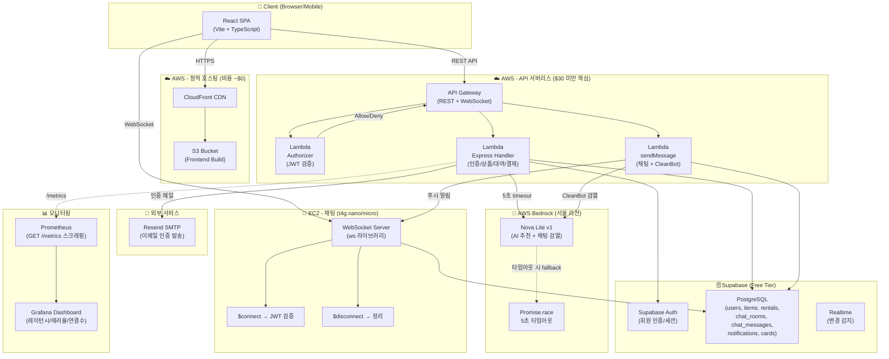
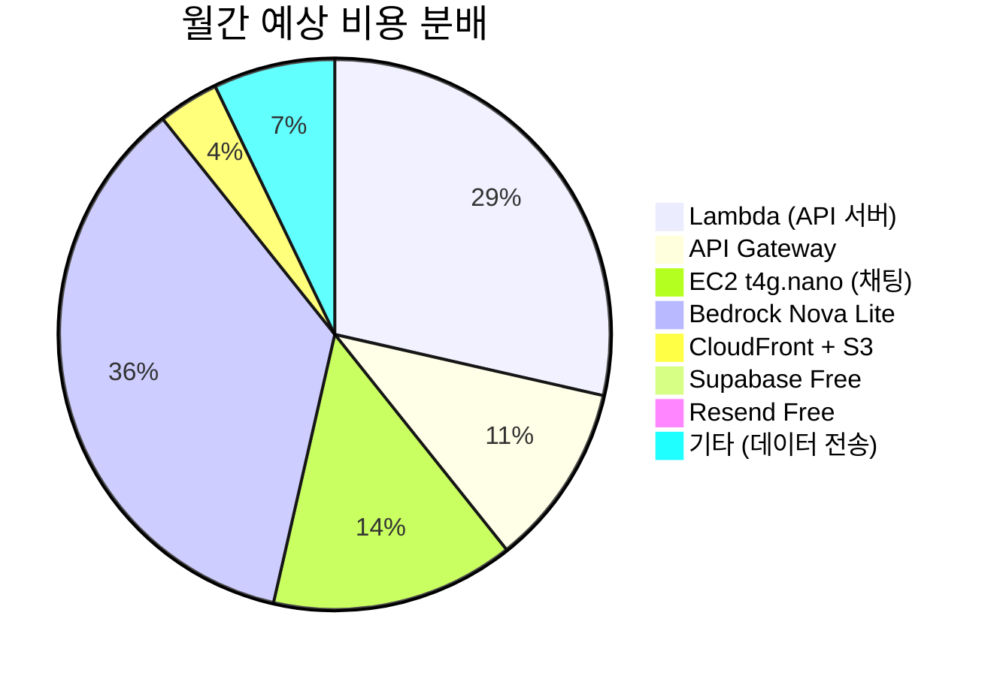

# HARUMAN 시스템 아키텍처

## 전체 인프라 구조도

## 데이터 흐름 상세

```mermaid
sequenceDiagram
    participant U as 사용자
    participant FE as React (CloudFront)
    participant GW as API Gateway
    participant AUTH as Lambda Authorizer
    participant API as Express Lambda
    participant AI as Bedrock Nova Lite
    participant DB as Supabase PostgreSQL
    participant WS as EC2 WebSocket
    participant MAIL as Resend

    %% 회원가입 흐름
    Note over U,MAIL: 📝 회원가입 + 이메일 인증
    U->>FE: 이메일 입력
    FE->>GW: POST /auth/send-verification
    GW->>API: (인증 불필요)
    API->>DB: users INSERT (미인증)
    API->>MAIL: 인증 메일 발송 (Resend)
    MAIL-->>U: 이메일 수신 → 링크 클릭
    U->>API: GET /auth/confirm?token=xxx
    API->>DB: is_verified = true
    API-->>U: 302 Redirect → /signup

    %% AI 추천 흐름
    Note over U,AI: 🤖 AI 물품 추천
    U->>FE: "캠핑 갈 건데 뭐 빌려?"
    FE->>GW: POST /ai/chat
    GW->>AUTH: JWT 검증
    AUTH-->>GW: Allow (userId in context)
    GW->>API: message 전달
    API->>AI: InvokeModel (5초 타임아웃)
    alt 정상 응답
        AI-->>API: {"reply":"...", "suggestedItemTypes":[...]}
        API-->>FE: 추천 결과
    else 타임아웃
        API-->>FE: fallback 메시지
    end

    %% 채팅 흐름
    Note over U,WS: 💬 실시간 채팅
    U->>WS: WebSocket connect (?token=JWT)
    WS->>DB: ws_connections INSERT
    WS-->>U: 연결 완료
    U->>WS: sendMessage {roomId, content}
    WS->>AI: CleanBot 검열
    AI-->>WS: PASSED / BANNED
    alt PASSED
        WS->>DB: chat_messages INSERT
        WS->>WS: 상대방 WebSocket push
        WS->>DB: notifications INSERT
    else BANNED
        WS-->>U: clean_bot_warning
    end
```

## 비용 구조 ($30/월 미만)

| 서비스 | 요금 | 비고 |
|--------|------|------|
| Lambda | ~$8 | 월 100만 요청 기준 |
| API Gateway | ~$3 | REST + WebSocket |
| EC2 t4g.nano | ~$4 | 프리티어 or $3.80/월 |
| Bedrock Nova Lite | ~$10 | 입출력 토큰 기반 |
| S3 + CloudFront | ~$1 | 정적 파일 서빙 |
| Supabase | $0 | Free Tier (500MB) |
| Resend | $0 | Free Tier (100통/일) |
| **합계** | **~$28** | **$30 미만 ✓** |

## 핵심 설계 원칙

1. **서버리스 우선**: Express를 Lambda에 올려 idle 비용 제로
2. **WebSocket은 EC2**: Lambda의 연결 제한(최대 10분)을 우회하여 지속 연결 보장
3. **AI 타임아웃 방어**: 5초 `Promise.race`로 Bedrock 지연이 전체 시스템에 전파되지 않도록 차단
4. **Prometheus 메트릭**: `/metrics` 엔드포인트로 Grafana 실시간 모니터링
5. **Supabase Free Tier 최적화**: Auth + DB를 하나의 무료 인스턴스로 통합
